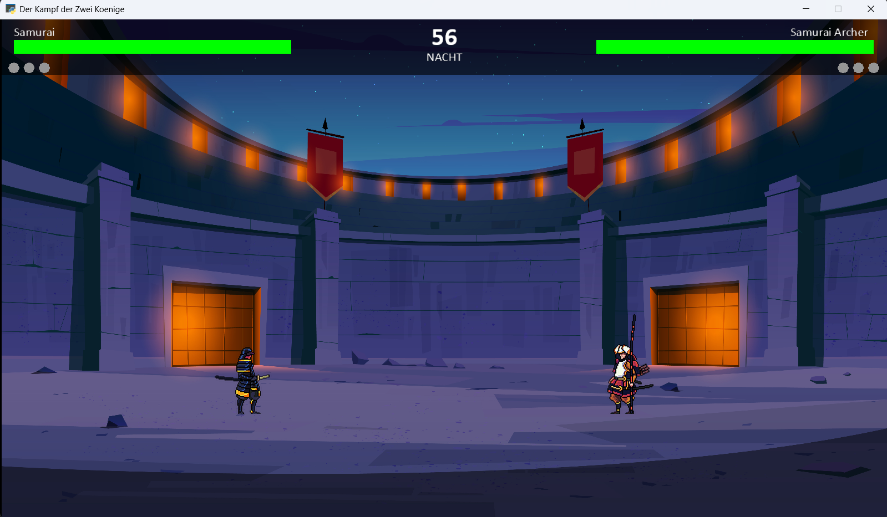

# The Battle of Empires

## Das Spiel
- Kurze Beschreibung des Spiels:

  In **The Battle of Empires** treten zwei Spieler in einem lokalen Arcade-Fighting-Game gegeneinander an. Ihr waehlt aus einem Kader historisch inspirierter Kaempfer wie Tutankhamun, Charlemagne oder verschiedene Samurai und liefert euch schnelle Duelle. Jede Runde endet, sobald eine Lebensleiste leer ist; wer zuerst drei Runden gewinnt, entscheidet das Match fuer sich. Zwischen den Kaempfen koennt ihr im Menü die Arena (Tag oder Nacht) und eure Charaktere wechseln.

- Wie wird das Spiel bedient? (Tastaturbelegung)

  - Spieler 1: `A` / `D` bewegen, `W` springen, `F` Schlag 1, `G` Schlag 2, `H` Schlag 3 
  - Spieler 2: `Pfeiltasten` bewegen, `Pfeil oben` springen, `0` Schlag 1, `1` Schlag 2, `2` Schlag `3`
  - `ESC` oeffnet das Menü; im Charakterauswahlmenü navigiert ihr mit der Maus.

- Bekannte Einschraenkungen (Dinge, die nicht funktionieren):

  - Es gibt keinen Einzelspieler-Modus oder KI-Gegner; das Spiel setzt zwei lokale Spieler voraus.
  - Controller-Unterstuetzung ist derzeit nicht implementiert.

- Screenshot des Spiels

  

## Installation
1. Voraussetzungen: Python 3.10 oder neuer sowie `pip`.
2. (Optional) Virtuelle Umgebung erstellen und aktivieren.
3. Abhaengigkeiten installieren: `python -m pip install -r requirements.txt` oder `python -m pip install "arcade==3.3.2"`
4. Spiel starten: `python3 main.py`

## Kurze Zusammenfassung des Projekts
- Lokales 2D-Fighting-Game als Softwareprojekt am Studienkolleg.
- Fokus auf animierte Kampfsprites, Soundeffekte und verschiedene Kampfstile.
- Menüfluss fuer Spielstart, Optionen, Charakterauswahl und Matchauswertung.

## Team Society
-: Sajad, Eddy und Vinh: Entwicklung, Game- und Sound-Integration.

## Weitere Informationen zum Projekt
- [Storyboard](docs/Storyboard.pdf)
- [Projektmanagement-Notizen](docs/project-management.md)
- Game-Design-Skizze (PDF): `docs/Game_Design_Canva`
